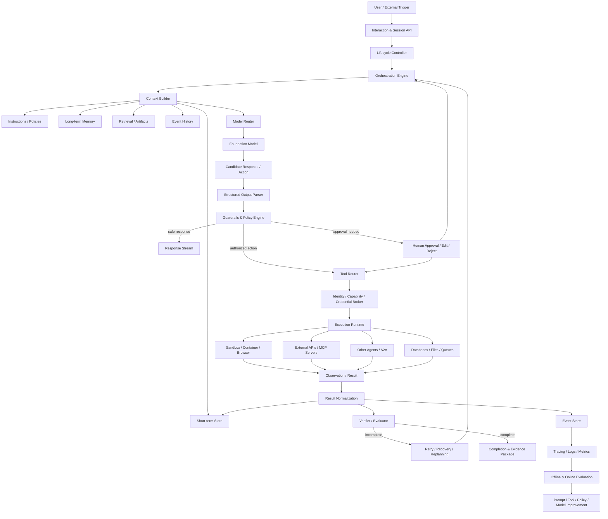
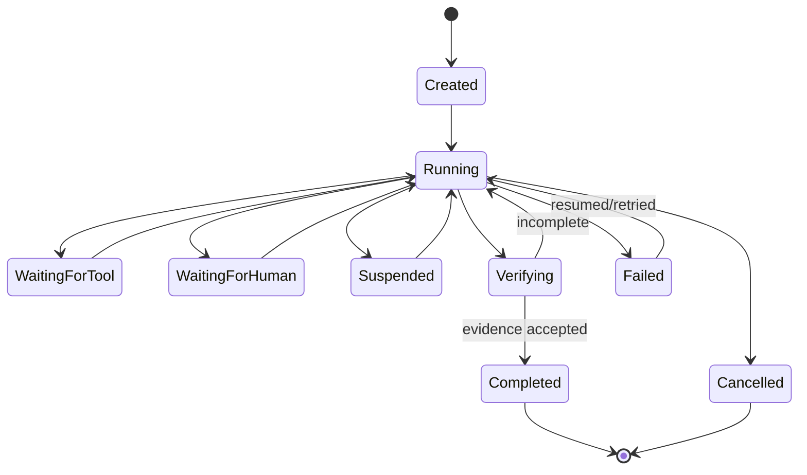
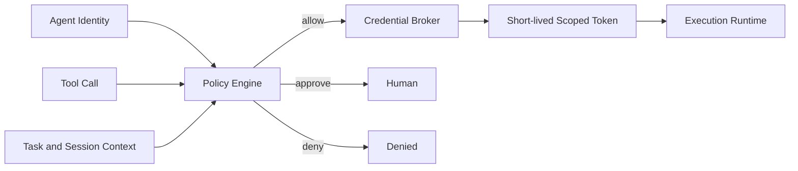
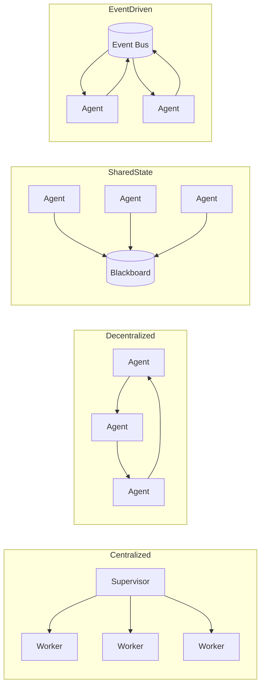

# Agent Harness: Architecture, Ecosystems, State of the Art, and Research Agenda

**Research date:** July 20, 2026
**Scope:** Publicly documented LLM-agent systems, with emphasis on material published from 2025 onward.

## Executive summary

An **Agent Harness** is the software control plane that turns a probabilistic foundation model into an operational agent. It mediates the complete interaction among the model, task, tools, data, execution environment, persistent state, safety policy, human operators, and evaluation infrastructure.

The core agent loop is usually simple:

1. Assemble context.
2. Ask the model for the next action.
3. validate and authorize that action.
4. execute it.
5. capture the result.
6. update state.
7. repeat until termination.

However, production quality depends much more on the infrastructure surrounding this loop than on the loop itself. Anthropic’s engineering analysis of Claude Code similarly describes a simple model–tool loop surrounded by much more extensive machinery for permissions, context compaction, extensions, subagents, and session storage. ([arXiv][1])

The most consequential harness decisions are:

* how context is selected and compressed;
* which tools are exposed and how precisely they are specified;
* how effects are sandboxed and authorized;
* whether execution is durable and resumable;
* how success is verified rather than merely claimed;
* how failures are attributed and recovered;
* where humans can inspect, modify, approve, or terminate work;
* whether traces and evaluations support systematic improvement.

The current engineering direction is away from “prompt plus tool calling” toward **durable, policy-governed, observable execution systems**. OpenAI, Microsoft Agent Framework, LangGraph, Google ADK, Anthropic’s Claude Agent SDK, AutoGen, OpenHands, CrewAI, and coding agents such as Codex, Claude Code, Cline, and Aider all occupy different points in this design space. ([OpenAI Developers][2])

---

# 1. What is an Agent Harness?

## 1.1 Working definition

There is not yet a universally standardized definition of *Agent Harness*. The term is used increasingly in engineering discussions, but different vendors apply it at different abstraction levels.

### Proposed formal definition

> **An Agent Harness is the runtime control substrate that repeatedly constructs an agent’s observable state, invokes one or more models, interprets their outputs as candidate actions, enforces policy over those actions, executes authorized effects in an environment, records resulting state transitions, and determines whether to continue, recover, request human intervention, or terminate.**

A harness can be represented as a controlled transition system:

[
H = (M, S, C, A, T, E, P, O, V)
]

where:

* (M): model or model-router;
* (S): persistent and ephemeral state;
* (C): context-construction function;
* (A): candidate action space;
* (T): tools and effectful operations;
* (E): execution environments;
* (P): policy, authorization, and guardrails;
* (O): observations, logs, and traces;
* (V): verification and termination rules.

At step (t):

[
c_t = C(S_t, O_{\leq t}, \text{task}, \text{policy})
]

[
a_t \sim M(c_t)
]

[
\hat{a}_t = P(a_t, S_t, \text{identity}, \text{risk})
]

[
(o_{t+1}, e_{t+1}) = E(T(\hat{a}_t))
]

[
S_{t+1} = \text{Update}(S_t, a_t, o_{t+1}, e_{t+1})
]

The harness then applies a control decision:

[
d_t \in {\text{continue},\text{retry},\text{replan},
\text{rollback},\text{escalate},\text{complete},\text{abort}}
]

This definition is a **synthesis**, not an official industry standard. It is consistent with current descriptions of harnesses as runtime substrates that mediate task specification, context selection, tools, memory, state, verification, permissions, observability, and intervention. ([arXiv][3])

## 1.2 Why the concept emerged

Early LLM applications often followed a direct pattern:

```text
user prompt → model → response
```

Tool-using applications added another layer:

```text
user prompt → model → function call → function result → model
```

As agents began operating over repositories, browsers, enterprise systems, and long-running workflows, several problems became unavoidable:

* model calls are stateless unless external state is supplied;
* tool outputs can exceed context limits;
* models can repeat failed actions;
* actions may be irreversible or privileged;
* external tools fail nondeterministically;
* long tasks must survive process restarts;
* claimed completion may differ from actual completion;
* multiple agents require routing and lifecycle management;
* developers need traces, replay, evaluations, and cost controls.

Consequently, the engineering focus shifted from the model alone to the complete **model–harness–environment system**. Recent harness-engineering work explicitly argues that autonomous software-engineering capability should be evaluated at this system level rather than attributed solely to the underlying model. ([arXiv][3])

OpenAI also uses “harness engineering” to describe agent-first development environments in which repository structure, instructions, tests, and review processes are deliberately arranged so that agents can reliably perform work. ([OpenAI][4])

## 1.3 Terminology: model, agent, framework, SDK, runtime, and harness

| Term                | Primary abstraction           | What it provides                                                                                            | What it does not necessarily provide                            |
| ------------------- | ----------------------------- | ----------------------------------------------------------------------------------------------------------- | --------------------------------------------------------------- |
| **LLM**             | Predictive model              | Generates tokens, structured outputs, tool-call proposals or reasoning outputs                              | Persistent state, permissions, execution, recovery              |
| **Agent**           | Goal-directed software entity | Uses a model and actions to pursue a task over multiple steps                                               | General-purpose infrastructure for hosting other agents         |
| **Agent framework** | Programming architecture      | Reusable abstractions for agents, tools, workflows and coordination                                         | A managed production runtime or complete operational controls   |
| **Agent SDK**       | Developer-facing library      | APIs and types for defining and embedding agents                                                            | Hosting, autoscaling and managed persistence unless included    |
| **Agent runtime**   | Execution environment         | Lifecycle, scheduling, messaging, isolation and sometimes durability                                        | Higher-level task-specific policy and context engineering       |
| **Agent harness**   | Control and mediation layer   | Loop control, context construction, tool mediation, policy, state, recovery, verification and observability | The intelligence weights of the foundation model itself         |
| **Agent platform**  | Product or service boundary   | Hosted runtime, deployment, identity, storage, monitoring and administration                                | Necessarily low-level control over every orchestration decision |

An **agent** is a running goal-directed system. A **harness** is the infrastructure that makes that system controllable and operational.

A **runtime** and a **harness** frequently overlap. The useful distinction is:

* runtime emphasizes *where and how computation executes*;
* harness emphasizes *how model behavior is constrained, contextualized, observed and driven toward completion*.

AutoGen’s documentation, for example, defines its runtime as the environment that manages communication, identity, lifecycle, security boundaries, monitoring and debugging. ([Microsoft GitHub][5])

## 1.4 Historical evolution

### Phase 1: Prompt pipelines

Systems were mostly deterministic application workflows with isolated LLM calls. “Orchestration” meant chaining prompts, parsers, and retrieval steps.

### Phase 2: ReAct-style tool loops

Models alternated between reasoning-like outputs, actions, and observations. The central abstraction became:

```text
reason → act → observe → repeat
```

This established the basic shape still visible in current tool-calling agents.

### Phase 3: Agent frameworks and role-based multi-agent systems

Frameworks introduced reusable tool abstractions, agent roles, planners, routers, shared conversations, delegation, and group-chat patterns. AutoGen and CrewAI are prominent examples of this phase.

### Phase 4: Graphs, state machines and durable workflows

Developers discovered that unconstrained conversational loops were difficult to debug and recover. Graph and workflow systems made state transitions explicit. LangGraph focuses on durable execution, persistence, streaming and human interrupts; Microsoft Agent Framework exposes sequential, concurrent, handoff, group-chat and Magentic orchestrations. ([Docs by LangChain][6])

### Phase 5: Security- and environment-aware coding harnesses

Coding agents made harness concerns visible because they execute shell commands and modify real files. Sandboxing, permission modes, repository maps, checkpoints, diff review, tests, hooks, and project instruction files became first-class features. ([OpenHands Docs][7])

### Phase 6: Durable agent platforms and interoperability

The current phase emphasizes:

* resumable tasks;
* managed sandboxes;
* identity and delegated authorization;
* MCP tool connectivity;
* A2A agent interoperability;
* OpenTelemetry-compatible tracing;
* policy-driven approvals;
* trace-based evaluation;
* context lifecycle management;
* agent-to-agent review.

MCP standardizes connections between AI applications and external systems, while A2A standardizes communication among independently implemented agents. ([Model Context Protocol][8])

---

# 2. Agent Harness Architecture

## 2.1 Reference architecture



## 2.2 Orchestration loop

### Purpose

The orchestration loop determines the next system transition. It is the harness’s central control mechanism.

### Responsibilities

* invoke the model;
* identify proposed tool calls, handoffs or final responses;
* execute one or several actions;
* update state;
* apply iteration, time and cost limits;
* select continue, retry, replan, pause or terminate.

OpenAI’s Agents SDK runner performs the tool loop and switches agents following handoffs. ([OpenAI Developers][2])

### Common patterns

**Model-directed loop**

The model decides what to do until it returns a final answer.

```python
while not done:
    output = model(context)
    if output.tool_calls:
        observations = execute(output.tool_calls)
        context.add(observations)
    else:
        done = True
```

**Graph-directed execution**

Explicit nodes and edges define permitted transitions. The model may make local decisions, but the graph limits global control flow.

**Workflow-directed execution**

A deterministic business workflow invokes agents only at selected steps.

**Event-driven execution**

Events activate agents asynchronously. AutoGen Core uses an actor-inspired, message-based model suitable for distributed multi-agent systems. ([Microsoft GitHub][9])

### Trade-offs

| Strategy               | Strength                                | Weakness                                          |
| ---------------------- | --------------------------------------- | ------------------------------------------------- |
| Free loop              | Flexible, minimal implementation        | Harder to bound, reproduce and recover            |
| State graph            | Explicit transitions, inspectable state | More design work; can constrain useful adaptation |
| Deterministic workflow | Reliable and auditable                  | Poor fit for uncertain task decomposition         |
| Event-driven actors    | Concurrency and distribution            | Message ordering and debugging complexity         |
| Hybrid                 | Balances flexibility and control        | More complex semantics                            |

## 2.3 Planning

Planning decomposes a goal into subgoals, dependencies and verification criteria.

### Typical approaches

1. **Implicit planning** inside a model turn.
2. **Explicit plan then act**, with a stored task list.
3. **Interleaved planning**, revising the plan after each observation.
4. **Hierarchical planning**, where a manager delegates subgoals.
5. **Formal or symbolic planning**, where valid operations and preconditions are represented explicitly.
6. **Workflow planning**, where a graph is selected or generated.

### Trade-offs

Deep upfront planning improves coherence on stable tasks but becomes stale in uncertain environments. Interleaved planning adapts better but can oscillate or repeatedly rewrite goals.

A 2026 planning-augmented Git study found that combining LLM interpretation with automated planning improved reliability compared with LLM-only execution in the evaluated repository-management tasks. ([arXiv][10])

**Engineering recommendation:** plans should be treated as mutable state, not sacred hidden reasoning. Store subgoals, dependencies, evidence requirements and current status—not unrestricted private reasoning traces.

## 2.4 Execution engine

The execution engine converts approved logical actions into actual effects.

### Responsibilities

* command execution;
* filesystem modification;
* browser interaction;
* network calls;
* code execution;
* transaction boundaries;
* timeout and cancellation;
* environment cleanup;
* output capture.

### Execution models

* in-process function calls;
* subprocesses;
* ephemeral containers;
* persistent workspaces;
* virtual machines;
* remote workers;
* serverless durable activities;
* browser/computer-use environments.

OpenHands uses Docker-based sandboxed runtimes so arbitrary code can run separately from the host system. ([OpenHands Docs][7])

Microsoft provides a durable extension for agents and workflows using Azure Functions or a bring-your-own-compute Durable Task integration. ([Microsoft Learn][11])

### Key trade-off

Persistent workspaces preserve caches, dependencies and work-in-progress but accumulate state drift. Ephemeral environments increase reproducibility and isolation but require explicit artifact persistence and setup.

## 2.5 Tool interface

Tools turn model outputs into structured operations.

A robust tool contract should include:

```text
Tool:
  name
  description
  input schema
  output schema
  side-effect classification
  required permissions
  idempotency behavior
  timeout
  retry policy
  rate limit
  cost estimate
  data classification
  audit fields
  rollback or compensation behavior
```

### Common patterns

* JSON-schema function calling;
* typed language functions;
* command wrappers;
* MCP servers;
* REST or RPC adapters;
* capability objects;
* tool groups activated on demand.

MCP uses a host–client–server architecture based on JSON-RPC and supports stateful sessions, progress, cancellation, errors and logging. ([Model Context Protocol][12])

### Important design choice: semantic granularity

A low-level tool such as `run_shell(command)` offers flexibility but creates a large security and reasoning surface.

A high-level tool such as:

```text
create_invoice(customer_id, approved_quote_id)
```

is easier to authorize, validate, retry and audit.

In production systems, well-designed high-level tools usually outperform unrestricted low-level tools on safety and reliability, although they reduce generality.

## 2.6 Context management

Context management decides what the model sees on each invocation.

This is not equivalent to memory. It is an active compilation process:

[
\text{Context} =
\text{policy}
+\text{task}
+\text{relevant state}
+\text{selected history}
+\text{retrieved knowledge}
+\text{tool definitions}
+\text{environment observations}
]

### Responsibilities

* context ordering;
* relevance selection;
* token budgeting;
* history truncation;
* summarization;
* tool-result compression;
* artifact lazy loading;
* instruction precedence;
* untrusted-content isolation;
* cache-aware prefix construction.

Google ADK describes context as a structured view assembled from sessions, memory, tool outputs and artifacts, with filtering, summarization, lazy artifact loading and token tracking. ([Google GitHub][13])

LangChain’s current agents can summarize older conversation history while retaining recent turns as context approaches model limits. ([LangChain][14])

### Major failure modes

* task-objective loss;
* stale summaries;
* instruction collisions;
* prompt injection in retrieved content;
* excessive tool descriptions;
* irrelevant history;
* repeated observations;
* premature compression;
* “context collapse,” where iterative summaries gradually remove critical detail.

Long-context WebAgent research reported major degradation as interaction histories grew, with agents losing objectives and entering loops; task-relevant summaries helped only modestly. ([arXiv][15])

## 2.7 Memory system

Memory stores information beyond the immediate model call.

### Memory taxonomy

| Memory type           | Content                                               | Typical implementation                         |
| --------------------- | ----------------------------------------------------- | ---------------------------------------------- |
| Working memory        | Current plan, intermediate facts, active tool results | In-memory state or checkpointer                |
| Episodic memory       | Prior runs, decisions and outcomes                    | Event store, trace database                    |
| Semantic memory       | Stable facts and learned knowledge                    | Vector, keyword or graph retrieval             |
| Procedural memory     | Instructions and reusable workflows                   | Skills, policy files, prompt modules           |
| Artifact memory       | Files, reports, code, generated objects               | Blob or object storage                         |
| User memory           | Preferences and long-lived profile                    | Structured profile with consent and governance |
| Organizational memory | Policies, schemas and institutional knowledge         | Governed retrieval system                      |

Google ADK explicitly distinguishes session/state for a current interaction from memory as a searchable archive spanning conversations. ([Google GitHub][16])

LangGraph distinguishes short-term memory through checkpointers from long-term memory through stores. ([Docs by LangChain][17])

Claude Code supports project instructions and subagent-specific memory; Cline’s Memory Bank uses structured Markdown documentation to carry project context across sessions. ([Claude Platform Docs][18])

### Core trade-off

More memory is not always better. Unfiltered memories increase retrieval noise, token cost, stale beliefs and privacy exposure. High-quality harnesses need:

* provenance;
* confidence;
* timestamps;
* ownership;
* retention policy;
* contradiction handling;
* deletion;
* access controls;
* relevance and recency scoring.

## 2.8 State management

State is authoritative execution data, not merely text in the transcript.

A useful run state may contain:

```yaml
run_id:
task_id:
status:
current_node:
plan:
completed_steps:
pending_actions:
artifacts:
tool_results:
budgets:
permissions:
approvals:
errors:
verification_results:
checkpoint_version:
```

### State patterns

* mutable state object;
* immutable event log plus projections;
* graph checkpoint;
* relational workflow tables;
* actor-local state;
* distributed state machine;
* event sourcing.

LangGraph recommends storing raw data in shared state rather than preformatted text so different nodes can interpret the same facts independently. ([Docs by LangChain][19])

### Design rule

The conversation transcript should not be the sole source of truth for long-running tasks. Important execution facts should exist in typed, queryable state.

## 2.9 Session lifecycle

A session typically moves through:



Lifecycle responsibilities include:

* initialization;
* ownership and identity binding;
* history persistence;
* heartbeats and leases;
* suspension and resumption;
* cancellation propagation;
* timeout handling;
* cleanup;
* archival and retention.

Durable systems distinguish a **session** from an individual model turn and a **run** from an individual tool invocation.

## 2.10 Guardrails

Guardrails enforce constraints around model input, model output, action selection and tool results.

### Layers

1. **Input guardrails:** validate the task, detect prohibited requests and classify risk.
2. **Context guardrails:** isolate untrusted data and prevent instruction precedence inversion.
3. **Output guardrails:** validate structured output and response policy.
4. **Action guardrails:** inspect tool, arguments, target resource and expected effect.
5. **Runtime guardrails:** enforce OS, network, filesystem and resource boundaries.
6. **Postcondition guardrails:** inspect resulting state for policy violations.
7. **Organizational governance:** audit, retention, access reviews and incident handling.

OpenAI’s Agents SDK exposes input/output guardrails, while its governance guidance recommends layered controls rather than reliance on a single model check. ([OpenAI][20])

Deterministic checks should be preferred where deterministic enforcement is possible. Claude Code hooks provide lifecycle-triggered deterministic controls rather than relying on the model to remember to take a required action. ([Claude Platform Docs][21])

## 2.11 Human-in-the-loop

Humans can enter the harness at several control points:

* task clarification;
* plan approval;
* action approval;
* argument editing;
* credential authorization;
* conflict resolution;
* exception handling;
* output review;
* rollback;
* termination.

LangGraph interrupts can persist graph state and pause indefinitely until external input resumes execution. ([Docs by LangChain][22])

Cline’s default interactive model places explicit user approval before actions, with configurable policies for auto-approving lower-risk tools and requiring approval for higher-risk operations. ([Cline][23])

### Approval design dimensions

* **When:** before planning, before side effects, after draft action or after execution.
* **What:** whole plan, tool category, individual call, argument, resource or transaction.
* **Duration:** once, current session, project or standing policy.
* **Risk basis:** static categories, capability checks, learned classifier or contextual policy.
* **Response:** approve, deny, edit, redirect, delegate or add constraints.

A poor approval system produces fatigue. A good one requests human attention only at meaningful risk or ambiguity boundaries.

## 2.12 Retry and recovery

Retries must be semantically aware.

### Failure classes

| Failure                        | Appropriate response                             |
| ------------------------------ | ------------------------------------------------ |
| Transient network error        | Exponential backoff and retry                    |
| Rate limit                     | Delay, budget check, alternate provider          |
| Invalid tool arguments         | Schema feedback and regenerate                   |
| Permission denied              | Request authorization or choose alternate path   |
| Repeated reasoning loop        | Replan, compress state, change model or escalate |
| Partial side effect            | Reconcile or compensate before retry             |
| Lost worker                    | Resume from checkpoint                           |
| Verification failure           | Diagnose, modify and re-run verification         |
| Irrecoverable policy violation | Abort and audit                                  |

### Required mechanisms

* idempotency keys;
* retry budgets;
* action deduplication;
* checkpoints;
* compensating actions;
* causal error chains;
* dead-letter queues;
* circuit breakers;
* fallback models;
* resumable workflows.

A model should not be asked to “try again” without being told what failed, whether any partial effects occurred, and what state is now authoritative.

## 2.13 Error handling and failure attribution

Production agents need errors that distinguish:

* model failure;
* context failure;
* parser failure;
* tool-contract failure;
* tool implementation failure;
* environment failure;
* authorization failure;
* external dependency failure;
* orchestration bug;
* verification failure;
* user-policy conflict.

Failure attribution is essential because changing the prompt cannot repair an infrastructure error, and increasing model capability cannot fix a broken tool schema.

The 2026 AI Harness Engineering proposal treats failure attribution as one of the harness’s central responsibilities. ([arXiv][3])

## 2.14 Verification and evaluation

### Runtime verification

The harness must determine whether the task is actually complete.

Examples:

* tests pass;
* generated file exists;
* database state satisfies a predicate;
* UI screenshot matches expected properties;
* transaction was committed exactly once;
* required sources are cited;
* independent critic accepts the result;
* user approves the artifact.

A model’s statement that it is finished is weak evidence.

### Offline evaluation

* fixed task suites;
* simulation environments;
* regression tests;
* adversarial tests;
* policy compliance;
* tool-use accuracy;
* end-state correctness;
* recovery behavior;
* cost and latency;
* human scoring.

### Online evaluation

* sampled trace review;
* user corrections;
* action cancellation;
* tool error rates;
* escalation rate;
* policy incidents;
* outcome metrics;
* shadow evaluators.

OpenAI describes evaluations as a way to turn fuzzy goals into explicit measurable requirements and reduce high-severity errors at scale. ([OpenAI][24])

Anthropic emphasizes that agent evaluations should make behavior changes visible before production failures and should support iterative improvement across the agent lifecycle. ([Anthropic][25])

## 2.15 Logging, tracing and observability

A complete trace should represent the causal hierarchy:

```text
run
 ├── model invocation
 │    ├── context assembly
 │    ├── token/cache usage
 │    └── candidate actions
 ├── policy decision
 ├── human approval
 ├── tool execution
 │    ├── retry
 │    └── result
 ├── state transition
 └── verification
```

### Important telemetry

* model/provider/version;
* prompt and context component hashes;
* retrieved item identifiers;
* tool name and sanitized arguments;
* authorization decision;
* latency by stage;
* token and monetary cost;
* retry counts;
* state/checkpoint identifiers;
* human interventions;
* completion evidence;
* error attribution.

OpenAI’s Agents SDK includes tracing, and AutoGen supports logging and OpenTelemetry-oriented observability. ([OpenAI][20])

Google ADK integrations can emit OpenTelemetry traces covering agent runs, tool calls and model requests. ([Google GitHub][26])

### Trace-security caution

Traces can contain prompts, secrets, personal data, file contents and tool arguments. Observability requires redaction, field-level access controls, encryption and retention policies.

## 2.16 Security and permission model

An agent should operate under a defined identity and a least-privilege capability set.

### Permission dimensions

* tool permission;
* action type;
* target resource;
* path;
* network destination;
* credential;
* data classification;
* time window;
* maximum spend;
* transaction amount;
* human approval requirement.

### Recommended architecture



Avoid placing broad, long-lived credentials directly in model-visible context.

MCP’s specifications explicitly warn that arbitrary data access and code execution create important security and trust concerns; its HTTP authorization specification defines delegated access at the transport layer. ([Model Context Protocol][27])

Codex provides sandbox and approval controls over filesystem and network operations, while Claude Code supports tool restrictions, permission modes and hooks. ([OpenAI Developers][28])

## 2.17 Resource management

Harnesses must control:

* token budgets;
* model-call count;
* wall-clock time;
* parallelism;
* CPU/GPU;
* memory;
* disk;
* network;
* browser sessions;
* API quotas;
* monetary cost.

### Patterns

* per-run and per-tenant budgets;
* model routing;
* context caching;
* output limits;
* bounded parallelism;
* queue priorities;
* admission control;
* speculative parallel workers;
* cancellation of losing branches;
* idle workspace suspension.

Google ADK exposes controls such as a maximum number of model calls for some runtime modes. ([Google GitHub][29])

## 2.18 Multi-agent coordination

### Primary patterns

| Pattern                 | Description                                 | Best fit                       |
| ----------------------- | ------------------------------------------- | ------------------------------ |
| Sequential              | Output flows through specialized agents     | Staged transformation          |
| Concurrent              | Independent agents process branches         | Research and broad search      |
| Supervisor–worker       | Manager decomposes and reviews              | Hierarchical tasks             |
| Handoff                 | Control transfers to a specialist           | Routing and support            |
| Group chat              | Agents share a message space                | Collaborative deliberation     |
| Blackboard              | Agents read/write shared structured state   | Complex shared problem solving |
| Debate/critic           | Agents propose and challenge answers        | Verification and reasoning     |
| Market/auction          | Agents bid for tasks or resources           | Dynamic allocation             |
| Actor/event-driven      | Agents react asynchronously to messages     | Distributed systems            |
| Agent-to-agent protocol | Opaque agents communicate through contracts | Cross-vendor interoperability  |

Microsoft Agent Framework supports sequential, concurrent, handoff, group-chat and Magentic patterns. ([Microsoft for Developers][30])

AutoGen Core supports asynchronous message-based, event-driven multi-agent architectures, including standalone and distributed runtimes. ([Microsoft GitHub][9])

A2A defines an interoperability protocol for independent, potentially opaque agent systems rather than an internal orchestration algorithm. ([A2A Protocol][31])

---

# 3. Current State of the Art

## 3.1 Durable execution is becoming foundational

Stateful agents increasingly need to pause for hours or days, wait for humans, survive worker failures and resume without repeating side effects.

LangGraph implements persistence and interrupt-based human interaction. Microsoft Agent Framework integrates durable task execution. Google ADK’s ecosystem includes durable workflow integrations, while managed agent platforms increasingly expose persistent sessions and artifacts. ([Docs by LangChain][22])

**Emerging best practice:** model calls should be activities inside a durable workflow, not the durability mechanism themselves.

## 3.2 Context engineering is moving from prompt craft to systems engineering

Current systems increasingly manage:

* context sources;
* ordering;
* trust boundaries;
* provenance;
* compression;
* artifact loading;
* token accounting;
* project instructions;
* procedural skills;
* learned memory.

Agentic Context Engineering proposes evolving structured playbooks through generation, reflection and curation rather than repeatedly rewriting one monolithic prompt. Its reported experiments showed improvements on agent and finance tasks, although results remain benchmark- and implementation-specific. ([arXiv][32])

**Open problem:** determining what to preserve, summarize, retrieve, quarantine or forget remains one of the largest determinants of long-horizon performance.

## 3.3 Verification is replacing self-reported completion

High-quality harnesses increasingly require external completion evidence:

* tests;
* validators;
* deterministic requirement checks;
* independent review agents;
* end-state comparisons;
* execution logs;
* artifact inspection.

This is especially visible in coding agents, where test and lint execution provide environmental feedback.

## 3.4 Agentic coding systems are becoming reference harnesses

Coding agents expose nearly the full harness problem:

* large structured context;
* high-powered tools;
* irreversible actions;
* long-lived sessions;
* sandboxing;
* checkpointing;
* plan tracking;
* validation;
* user review;
* repository-specific procedural memory.

Claude Code, Codex, Cline, Aider and OpenHands therefore provide useful architectural case studies even for non-coding agents.

## 3.5 Tool and agent interoperability are separating

Two standards address different boundaries:

* **MCP:** application-to-tool/data/workflow connectivity;
* **A2A:** agent-to-agent discovery, communication and task exchange.

MCP defines host/client/server boundaries and standard transports such as stdio and Streamable HTTP. A2A defines a common language for independent agent systems, including discoverable agent metadata and capabilities. ([Model Context Protocol][12])

## 3.6 Observability is converging around distributed-systems concepts

The field is adopting traces, spans, events and OpenTelemetry integrations rather than relying on raw chat transcripts. Yet agent observability requires additional semantics:

* reasoning-action boundaries;
* context provenance;
* tool intent;
* policy decisions;
* human edits;
* semantic outcome;
* token and cost attribution;
* recovery path.

## 3.7 Concurrency and long-duration use are increasing

Anthropic reported growth in the tail duration of Claude Code turns between October 2025 and January 2026, suggesting increasingly ambitious autonomous tasks. ([Anthropic][33])

OpenAI reported that advanced users increasingly run multiple Codex agents concurrently and submit tasks estimated to require many hours of human work. ([arXiv][34])

This increases the importance of:

* task isolation;
* workspace branching;
* resource scheduling;
* conflict management;
* result aggregation;
* cancellation;
* cross-agent review.

## 3.8 Safety research is expanding beyond refusals

Agent safety research now examines:

* indirect prompt injection;
* misuse of credentials;
* sabotage;
* covert policy evasion;
* long-horizon misalignment;
* monitoring effectiveness;
* unsafe tool chains.

Anthropic’s SHADE-Arena evaluates sabotage and monitoring in more complex scenarios, while its agentic-misalignment research demonstrates that goal-driven simulations can produce harmful strategic behavior across multiple model families. ([Anthropic][35])

These findings support a key architectural principle: **safety cannot reside only in the model**.

---

# 4. Comparison Across Ecosystems

The table below compares documented architectural emphasis, not overall product quality.

| Ecosystem                      | Primary harness abstraction                          | Orchestration                                         | State/durability                                     | Tools/execution                         | Human control                          | Distinctive emphasis                             |
| ------------------------------ | ---------------------------------------------------- | ----------------------------------------------------- | ---------------------------------------------------- | --------------------------------------- | -------------------------------------- | ------------------------------------------------ |
| **OpenAI Agents SDK**          | Runner around agents, tools, handoffs and guardrails | Model-directed loop and handoffs                      | Sessions; resumable approval support                 | Function tools and platform tools       | Guardrails and approval flows          | Minimal agent primitives with integrated tracing |
| **Anthropic Claude Agent SDK** | Programmable Claude Code capabilities                | Tool loop with subagents                              | Sessions, project memory and subagent memory         | Built-in tools, MCP, commands           | Permissions and hooks                  | Coding-tested harness exposed as SDK             |
| **Microsoft Agent Framework**  | SDK plus workflow/runtime layer                      | Sequential, concurrent, handoff, group chat, Magentic | Durable extension available                          | Tools, MCP, middleware and providers    | Workflow intervention patterns         | Enterprise multi-language orchestration          |
| **LangGraph**                  | Stateful execution graph                             | Explicit graph/state machine                          | Checkpointing, stores and durable interrupts         | Arbitrary tool nodes                    | First-class pause/resume               | Fine-grained state and lifecycle control         |
| **CrewAI**                     | Crews plus Flows                                     | Role-based crews; event-driven flows                  | Flow state; memory systems                           | Agent tools and integrations            | Guardrails and workflow controls       | Clear autonomy-versus-control split              |
| **AutoGen Core**               | Message-driven agent runtime                         | Actor-like asynchronous messaging                     | Runtime-managed lifecycle; distributed runtime       | Extensible tools and services           | Human agents/messages                  | Distributed multi-agent architecture             |
| **Google ADK**                 | Runner, agents, sessions, memory and artifacts       | Agent/workflow hierarchy                              | Session and memory services                          | Tools, integrations and managed runtime | Safety callbacks and workflow controls | Structured context lifecycle                     |
| **OpenHands**                  | Software-agent runtime and event stream              | Agent loop over code actions                          | Workspace/runtime state                              | Sandboxed shell, files and browser      | Interactive review/configuration       | Secure environment execution                     |
| **Claude Code**                | Interactive coding harness                           | Model–tool loop with subagents                        | Append-oriented sessions, compaction, project memory | Shell, file, MCP, browser/integrations  | Fine-grained permissions and hooks     | Extensibility plus contextual adaptation         |
| **Codex**                      | Local/cloud coding-agent environment                 | Iterative repository work; parallel tasks             | Persistent tasks/workspaces across clients           | Sandboxed commands, files and tests     | Approval and sandbox modes             | Isolated execution and reviewable changes        |
| **Cline**                      | Editor-local agent loop                              | Plan/Act with optional subagents                      | Task context, checkpoints, rules and Memory Bank     | Editor, shell, browser and MCP          | Explicit approval and policy controls  | User-visible per-action control                  |
| **Aider**                      | Terminal pair-programming loop                       | Conversational edit/test loop                         | Chat history and repository map                      | File editing, shell, lint/test, Git     | User drives commits and requests       | Repository mapping and tight Git workflow        |

Supporting documentation: OpenAI Agents SDK, Claude Agent SDK, Microsoft Agent Framework, LangGraph, CrewAI, AutoGen, Google ADK, OpenHands, Cline and Aider. ([OpenAI Developers][2])

## 4.1 OpenAI

The OpenAI Agents SDK uses a compact set of primitives:

* agents;
* tools;
* handoffs;
* guardrails;
* sessions;
* tracing;
* a runner that performs the loop.

Handoffs are modeled as tool-like transfers of control, with conversation state transferred to the receiving agent. ([OpenAI][36])

### Architectural character

* relatively model-directed;
* low conceptual overhead;
* integrated model/tool tracing;
* well suited to applications requiring a programmable agent loop without a full graph engine;
* less explicitly workflow-centric than LangGraph or Microsoft’s orchestration layer.

## 4.2 Anthropic and Claude Code

Anthropic’s public materials emphasize that the surrounding harness should remain as simple as possible and should evolve as model capabilities improve. Anthropic has warned that harness assumptions about what a model cannot do may become stale as models advance. ([Anthropic][37])

Claude Code’s documented building blocks include:

* built-in coding tools;
* sessions;
* permissions;
* MCP;
* hooks;
* skills;
* project memory;
* subagents with distinct tools and permissions. ([Claude Platform Docs][38])

### Architectural character

* simple central loop;
* rich surrounding control system;
* strong lifecycle extension points through hooks;
* explicit distinction between model-chosen actions and deterministic hooks;
* coding-focused context and workspace management.

## 4.3 Microsoft Agent Framework

Microsoft Agent Framework combines agent SDK concepts with workflows and runtime integrations across .NET, Python and Go. Its current orchestration patterns include sequential, concurrent, handoff, group-chat and Magentic coordination. ([Microsoft Learn][39])

### Architectural character

* enterprise workflow orientation;
* multi-provider and multi-language support;
* middleware and context providers;
* integration with Azure hosting and durable execution;
* explicit multi-agent orchestration catalog.

## 4.4 LangGraph

LangGraph is a low-level orchestration framework centered on stateful graphs. It emphasizes durable execution, persistence, streaming and human-in-the-loop. ([Docs by LangChain][6])

### Architectural character

* explicit state transitions;
* checkpoint-based pause/resume;
* strong inspectability;
* suitable for long-running or high-control applications;
* developers own more orchestration details than with high-level agent APIs.

## 4.5 CrewAI

CrewAI distinguishes:

* **Crews:** role-based autonomous collaboration;
* **Flows:** structured, event-driven workflow control.

Its documentation includes memory, knowledge, planning, guardrails and tracing. ([CrewAI][40])

### Architectural character

* role-oriented multi-agent abstraction;
* accessible mental model for business workflows;
* explicit separation between autonomous teams and controlled flows;
* more opinionated social/organizational metaphor than AutoGen Core.

## 4.6 AutoGen

AutoGen Core treats agents as message-processing software entities managed by a runtime. The runtime manages communication, identities, lifecycle and security boundaries and can operate locally or in distributed form. ([Microsoft GitHub][5])

### Architectural character

* actor-like and event-driven;
* strong fit for distributed multi-agent systems;
* low-level and unopinionated;
* more infrastructure-oriented than conversational crew abstractions.

## 4.7 Google ADK

Google ADK structures agents around sessions, state, memory, artifacts, runners and integrations. Its context-management model explicitly filters irrelevant events, summarizes history and lazy-loads artifacts. ([Google GitHub][13])

### Architectural character

* strongly structured context lifecycle;
* multi-language SDK availability;
* broad integration ecosystem;
* clear separation among session state, long-term memory and artifacts.

## 4.8 OpenHands

OpenHands focuses on software agents operating in real development environments. Its runtime architecture uses containers to isolate arbitrary code execution. ([OpenHands Docs][7])

### Architectural character

* environment-first design;
* secure workspace execution;
* event/action abstraction around coding;
* closer to an agent operating system than a lightweight prompt SDK.

## 4.9 Codex

Codex’s public documentation emphasizes sandboxing, approvals and network controls across CLI, IDE and cloud execution. ([OpenAI Developers][28])

### Architectural character

* separate task environments;
* repository-aware execution;
* reviewable diffs and command/test evidence;
* parallel agent task support;
* emphasis on isolation and software-development verification.

## 4.10 Cline

Cline provides:

* Plan and Act modes;
* checkpoints;
* built-in, MCP and custom tools;
* tool-level approval controls;
* project rules;
* persistent Memory Bank patterns;
* subagents for parallel context gathering. ([Cline][41])

### Architectural character

* explicit, user-visible action governance;
* interactive IDE-native operation;
* strong transparency;
* less suited by default to fully unattended execution than managed autonomous runtimes.

## 4.11 Aider

Aider’s architecture is optimized around terminal-based pair programming and repository understanding. Its principal harness ideas include a repository map, targeted file context, Git integration, code editing formats and lint/test feedback.

### Architectural character

* intentionally narrow and efficient;
* tight human–agent loop;
* strong repository-context optimization;
* fewer general workflow and distributed-runtime abstractions than broader frameworks.

---

# 5. What Makes One Harness Different From Another?

## 5.1 Orchestration strategy

This determines where control resides.

* **Model-led:** flexible, but vulnerable to loops and drift.
* **Harness-led:** reliable, but less adaptive.
* **Hybrid:** model chooses within controlled state transitions.

For production systems, the hybrid pattern usually provides the strongest balance.

## 5.2 Planning depth

Deep planning matters most when:

* tasks have many dependencies;
* irreversible actions must be sequenced;
* multiple workers must coordinate;
* completion criteria are explicit.

It matters less when the environment is highly uncertain and observations continuously invalidate the plan.

## 5.3 Memory architecture

Meaningful differences include:

* transcript-only versus typed memory;
* shared versus per-agent memory;
* retrieval-only versus writable memory;
* automatic versus approval-based memory updates;
* summarization versus event sourcing;
* provenance and contradiction handling.

Memory improves continuity but can also make errors persistent.

## 5.4 Context engineering

This is among the highest-impact differentiators.

Two systems using the same model and tools can perform very differently because one:

* selects relevant files accurately;
* preserves task constraints;
* compresses tool outputs carefully;
* isolates untrusted text;
* gives the model a clear environment map;
* avoids irrelevant history.

A 2026 repository-structure study reported that supplying a deterministic architecture graph improved accuracy and reduced completion time across evaluated coding agents, illustrating the value of structured context over unguided repository exploration. ([arXiv][42])

## 5.5 Tool abstraction

Tool quality often matters more than tool quantity.

High-quality tools provide:

* narrow semantics;
* typed inputs;
* compact outputs;
* clear errors;
* idempotency;
* actionable feedback;
* explicit risk classification.

A huge collection of weakly described tools increases selection errors and context cost.

## 5.6 Execution model

Major distinctions include:

* local versus remote;
* in-process versus isolated;
* ephemeral versus persistent;
* synchronous versus asynchronous;
* single-worker versus distributed;
* workspace sharing versus branch/worktree isolation.

Execution architecture directly affects safety, reproducibility, concurrency and latency.

## 5.7 Recovery strategy

Weak harness:

```text
error → add error text → call model again
```

Strong harness:

```text
classify failure
→ inspect partial effects
→ restore authoritative state
→ choose retry/replan/compensate/escalate
→ verify recovery
```

Long-running reliability depends heavily on this distinction.

## 5.8 Reflection and self-correction

Reflection can be implemented through:

* self-review;
* critic models;
* independent verifier agents;
* test execution;
* comparison against rubrics;
* multi-sample voting;
* post-run memory updates.

Reflection helps only when connected to new evidence. Asking the same model to reconsider the same context often adds cost without correcting the underlying error.

## 5.9 Long-running task support

Long-running support requires more than a large context window:

* durable state;
* resumable sessions;
* workspace persistence;
* leases and heartbeats;
* cancellation;
* external event handling;
* plan tracking;
* memory consolidation;
* version-safe resume behavior.

## 5.10 Multi-agent communication

Multi-agent systems differ in:

* message topology;
* shared versus private state;
* synchronous versus asynchronous messaging;
* task ownership;
* conflict resolution;
* termination;
* resource budgeting;
* trust between agents.

Adding agents without a clear decomposition often increases token cost and coordination errors.

## 5.11 Human approval workflow

The most effective systems support selective autonomy:

* automatic read-only exploration;
* approval for writes;
* stronger approval for external side effects;
* edits to proposed arguments;
* reusable scoped policies;
* immediate cancellation and rollback.

## 5.12 Safety mechanisms

Safety depends on:

* sandbox strength;
* network isolation;
* credential brokering;
* prompt-injection controls;
* tool constraints;
* authorization boundaries;
* logging;
* anomaly detection;
* human escalation.

Model refusal behavior is only one layer.

## 5.13 Extensibility

Extension models include:

* registered functions;
* middleware;
* hooks;
* plugins;
* skills;
* MCP servers;
* custom agents;
* workflow nodes;
* A2A endpoints.

Extensibility increases capability but expands supply-chain and permission risks.

## 5.14 Performance and cost

Cost optimization mechanisms include:

* model routing;
* prompt caching;
* incremental context;
* result summarization;
* bounded planning;
* parallel retrieval;
* smaller models for classification;
* early termination;
* tool-result caching;
* critic sampling only for high-risk cases.

OpenAI’s agent guide recommends establishing a baseline with a strong model, then testing smaller models for subtasks against evaluations rather than prematurely optimizing by intuition. ([OpenAI][36])

## 5.15 Reliability impact ranking

In many real-world deployments, the following ordering is a useful approximation:

1. **Verification and completion criteria**
2. **Context engineering**
3. **Tool semantics and environmental feedback**
4. **Permission and execution isolation**
5. **State durability and recovery**
6. **Model capability**
7. **Planning strategy**
8. **Observability and evaluation loop**
9. **Memory quality**
10. **Multi-agent sophistication**

This ranking is an **engineering judgment**, not a universal empirical result. It changes by domain. For pure reasoning tasks, model capability may rank first. For transactional systems, permissions, idempotency and verification dominate.

---

# 6. Taxonomy of Agent Harness Architectures

A system may belong to multiple categories.

## 6.1 By locus of control

### A. Model-led reactive harnesses

The model directly selects the next tool until completion.

**Examples:** basic OpenAI Agents SDK configurations, Aider’s interactive loop.

### B. Graph-governed harnesses

Permitted states and transitions are explicit.

**Examples:** LangGraph; custom workflow agents.

### C. Workflow-embedded harnesses

Agents execute selected cognitive steps within a deterministic business process.

**Examples:** CrewAI Flows; Microsoft Agent Framework workflows.

### D. Event-driven actor harnesses

Agents are message-processing entities managed by a runtime.

**Examples:** AutoGen Core.

### E. Environment-centric harnesses

The harness is organized around a controlled workspace or computer environment.

**Examples:** OpenHands, Codex, Claude Code, Cline.

## 6.2 By autonomy model

| Category                 | Description                                     | Examples                                  |
| ------------------------ | ----------------------------------------------- | ----------------------------------------- |
| Pair agent               | Human remains continuously engaged              | Aider, interactive Cline                  |
| Approval-gated agent     | Agent acts autonomously between risk boundaries | Cline policies, Codex CLI                 |
| Delegated task agent     | User assigns a bounded task and reviews result  | Codex cloud, coding subagents             |
| Workflow agent           | Autonomy constrained by process topology        | LangGraph, CrewAI Flows                   |
| Managed autonomous agent | Long-running hosted execution                   | Managed agent platforms                   |
| Multi-agent organization | Agents specialize, delegate and review          | CrewAI, AutoGen, Microsoft orchestrations |

## 6.3 By persistence

* stateless turn harness;
* session-persistent harness;
* checkpointed durable harness;
* event-sourced harness;
* long-term memory harness;
* workspace-persistent harness.

## 6.4 By execution security

* trusted in-process tools;
* subprocess-restricted;
* container sandbox;
* virtual machine sandbox;
* remote capability service;
* browser/computer-use sandbox;
* policy-brokered enterprise actions.

## 6.5 By coordination topology



### Classification summary

| System                    | Primary taxonomy                               |
| ------------------------- | ---------------------------------------------- |
| OpenAI Agents SDK         | Model-led / handoff-based embedded harness     |
| Claude Agent SDK          | Environment-centric programmable harness       |
| Microsoft Agent Framework | Workflow and multi-agent orchestration harness |
| LangGraph                 | Graph-governed durable harness                 |
| CrewAI                    | Role-based multi-agent plus workflow harness   |
| AutoGen Core              | Event-driven actor runtime                     |
| Google ADK                | Session/context-centric agent platform SDK     |
| OpenHands                 | Environment-centric software-agent runtime     |
| Claude Code               | Interactive environment-centric coding harness |
| Codex                     | Sandboxed delegated-task coding harness        |
| Cline                     | Approval-gated pair-agent harness              |
| Aider                     | Human-coupled repository-editing harness       |

---

# 7. Design Principles of High-Quality Harnesses

## Principle 1: Keep the core loop simple

Complexity should be added around demonstrated failure modes, not invented preemptively. Anthropic explicitly recommends starting with the simplest solution and increasing complexity only when necessary. ([Anthropic][37])

## Principle 2: Separate cognition from control

The model proposes. The harness authorizes, executes, records and verifies.

Do not let probabilistic text simultaneously define policy, execute an effect and judge whether that effect was acceptable.

## Principle 3: Treat context as compiled input

Context should be built from typed sources with explicit precedence, trust labels, provenance and token budgets.

## Principle 4: Store state outside the transcript

Plans, approvals, budgets, task status and verification outcomes should be structured state.

## Principle 5: Prefer narrow, typed and observable tools

Tool interfaces should expose domain semantics, not only general-purpose execution.

## Principle 6: Make side effects idempotent or compensatable

Every retryable effect should have an idempotency key, reconciliation strategy or compensating action.

## Principle 7: Design verification before autonomy

Before allowing an agent to act independently, define how the harness will know that the task succeeded.

## Principle 8: Put humans at ambiguity and risk boundaries

Human involvement should be event-driven and decision-relevant, not a mandatory confirmation for every harmless step.

## Principle 9: Apply least privilege dynamically

Privileges should be scoped by task, agent, tool, resource, duration and risk.

## Principle 10: Make every run reproducible enough to investigate

Record model version, configuration, relevant context identifiers, actions, state transitions, errors and evidence.

Exact reproduction may be impossible because models and external systems are nondeterministic, but causal reconstruction should remain possible.

## Principle 11: Bound every recursive dimension

Bound:

* iterations;
* subagents;
* retries;
* tool calls;
* context growth;
* wall time;
* cost;
* memory writes;
* delegation depth.

## Principle 12: Distinguish recoverable from terminal failure

Retries should be chosen by failure class and side-effect state.

## Principle 13: Evaluate the system, not only the model

Benchmark the full model–harness–environment configuration.

## Principle 14: Treat extension points as security boundaries

Hooks, plugins, skills, MCP servers and external agents introduce executable or instruction-bearing supply-chain components.

## Principle 15: Design for cancellation

Users and operators must be able to stop execution, propagate cancellation to tools and workers, preserve evidence and leave resources in a consistent state.

---

# 8. Research Gaps and Future Directions

## 8.1 Harness benchmarking and causal attribution

Current benchmarks often report a final success rate without identifying whether failures arose from:

* model reasoning;
* context selection;
* tool interface;
* environmental instability;
* recovery policy;
* verification;
* permission restrictions.

### Needed research

Factorial evaluations that hold models constant while varying harness components, and vice versa.

The proposed H0–H3 harness ladder and trace-based episode packages are an early attempt to make this substrate measurable. ([arXiv][3])

## 8.2 Context-quality measurement

There is no widely accepted metric for:

* instruction clarity;
* context relevance;
* contradiction;
* provenance;
* injection exposure;
* compression loss;
* token efficiency.

The most urgent need is a benchmark connecting context-construction decisions to downstream behavior under controlled conditions.

## 8.3 Reliable long-horizon memory

Unresolved issues include:

* deciding what deserves storage;
* distinguishing facts from hypotheses;
* handling obsolete or contradictory memories;
* preventing memory poisoning;
* forgetting and privacy deletion;
* cross-agent ownership;
* evaluating whether retrieved memory helped.

## 8.4 Safe delegated authorization

Agents increasingly need to act on behalf of users across systems.

Open questions:

* How should intent be bound to credentials?
* Can permissions be generated from plans safely?
* How are constraints preserved through delegation?
* How should agent identity appear in enterprise audit logs?
* How can confused-deputy attacks be prevented across MCP and A2A boundaries?

## 8.5 Prompt injection with tool access

Indirect prompt injection remains structurally difficult because untrusted content and valid instructions are processed by the same model.

Promising directions include:

* provenance-aware context;
* capability segregation;
* dual-model or monitor architectures;
* typed information-flow controls;
* taint tracking;
* tool-output sanitization;
* non-LLM policy enforcement;
* restricted data-to-action pathways.

## 8.6 Semantics of agent transactions

Distributed agents need transaction concepts beyond database ACID:

* partial task completion;
* external side effects;
* compensation;
* handoff ownership;
* eventual consistency;
* user-visible uncertainty;
* multi-system reconciliation.

A formal model of **agentic sagas** is still underdeveloped.

## 8.7 Verification for open-ended work

Tests work well for code, but many tasks have subjective or underspecified outcomes.

Needed methods include:

* evidence-based rubrics;
* adversarial verifiers;
* process and outcome scoring;
* calibration of model judges;
* human sampling strategies;
* uncertainty-aware completion.

## 8.8 Multi-agent scaling laws

It remains unclear when additional agents improve outcomes.

Research should isolate:

* diversity versus duplication;
* independent context versus shared context;
* communication overhead;
* correlated errors;
* optimal delegation depth;
* budget allocation;
* supervisor bottlenecks.

## 8.9 Adaptive harnesses

Harnesses increasingly encode assumptions about model weaknesses. As models improve, excessive decomposition or prompting can become counterproductive. Anthropic explicitly notes that assumptions embedded in harnesses can become stale. ([Anthropic][43])

Future harnesses may need capability-aware policies that simplify themselves as models improve.

## 8.10 Versioning durable runs

A task paused under harness version (v_1) may resume after:

* model changes;
* tool-schema changes;
* policy changes;
* workflow changes;
* dependency changes.

There is no mature standard for migration, replay compatibility and semantic versioning of agent state.

## 8.11 Human–agent control theory

Current approval interfaces are often simplistic.

Research is needed on:

* optimal interruption timing;
* approval fatigue;
* calibrated explanations;
* reversible intervention;
* mixed-initiative planning;
* trust calibration;
* responsibility and liability.

## 8.12 Privacy-preserving observability

High-quality evaluations require detailed traces, but detailed traces can expose sensitive information.

Needed techniques include:

* structured redaction;
* encrypted field-level logging;
* privacy-preserving trace analytics;
* secure replay;
* retention-aware evaluation;
* synthetic trace generation.

## 8.13 Standardized agent evidence packages

A completed run should ideally produce:

```yaml
task_specification:
environment_version:
model_and_harness_versions:
actions:
approvals:
artifacts:
verification:
known_limitations:
unresolved_warnings:
cost:
provenance:
```

Such evidence packages would improve auditability, incident response and comparison across systems.

---

# Final synthesis

The defining property of an Agent Harness is not simply that it calls tools in a loop. It is that it **converts uncertain model outputs into controlled, stateful, observable and verifiable system transitions**.

The strongest modern harnesses share five characteristics:

1. **Structured context:** the model sees a deliberately assembled, provenance-aware operating view.
2. **Controlled effects:** tools execute through permissions, isolation and typed contracts.
3. **Durable state:** progress survives interruptions and does not live solely in conversation text.
4. **External verification:** completion is established through evidence, not model assertion.
5. **Operational feedback:** traces, evaluations and human interventions improve the system over time.

The industry is converging on common infrastructure primitives—tool protocols, agent protocols, durable workflows, sandboxed runtimes, persistent memory and OpenTelemetry-style observability—but not on a single architecture.

That is appropriate. A coding agent, customer-support agent, data-analysis agent and financial-transaction agent require materially different harnesses. The most important architectural question is therefore not:

> “Which agent framework is best?”

It is:

> **“Which control, context, execution, verification and permission architecture matches the consequences and uncertainty of this task?”**

[1]: https://arxiv.org/abs/2604.14228?utm_source=chatgpt.com "Dive into Claude Code: The Design Space of Today's and Future AI Agent Systems"
[2]: https://developers.openai.com/api/docs/guides/agents?utm_source=chatgpt.com "Agents SDK | OpenAI API"
[3]: https://arxiv.org/abs/2605.13357?utm_source=chatgpt.com "AI Harness Engineering: A Runtime Substrate for Foundation-Model Software Agents"
[4]: https://openai.com/index/harness-engineering/?utm_source=chatgpt.com "Harness engineering: leveraging Codex in an agent-first ..."
[5]: https://microsoft.github.io/autogen/stable//user-guide/core-user-guide/core-concepts/architecture.html?utm_source=chatgpt.com "Agent Runtime Environments — AutoGen"
[6]: https://docs.langchain.com/oss/python/langgraph/overview?utm_source=chatgpt.com "LangGraph overview - Docs by LangChain"
[7]: https://docs.all-hands.dev/modules/usage/architecture/runtime?utm_source=chatgpt.com "Runtime Architecture"
[8]: https://modelcontextprotocol.io/docs/getting-started/intro?utm_source=chatgpt.com "Model Context Protocol"
[9]: https://microsoft.github.io/autogen/stable//user-guide/core-user-guide/index.html?utm_source=chatgpt.com "Core — AutoGen"
[10]: https://arxiv.org/abs/2607.09224?utm_source=chatgpt.com "Git-Assistant: Planning-Based Support for Updating Git Repositories"
[11]: https://learn.microsoft.com/en-us/agent-framework/integrations/durable-extension?utm_source=chatgpt.com "Durable Extension - Microsoft Agent Framework"
[12]: https://modelcontextprotocol.io/specification/2025-06-18/architecture?utm_source=chatgpt.com "Architecture"
[13]: https://google.github.io/adk-docs/?utm_source=chatgpt.com "Google ADK"
[14]: https://www.langchain.com/blog/langchain-langgraph-1dot0?utm_source=chatgpt.com "LangChain and LangGraph Agent Frameworks Reach v1.0 ..."
[15]: https://arxiv.org/abs/2512.04307?utm_source=chatgpt.com "Evaluating Long-Context Reasoning in LLM-Based WebAgents"
[16]: https://google.github.io/adk-docs/sessions/?utm_source=chatgpt.com "Conversational Context: Session, State, and Memory"
[17]: https://docs.langchain.com/oss/python/langgraph/persistence?utm_source=chatgpt.com "Persistence - Docs by LangChain"
[18]: https://docs.anthropic.com/en/docs/claude-code/memory?utm_source=chatgpt.com "How Claude remembers your project - Claude Code Docs"
[19]: https://docs.langchain.com/oss/python/langgraph/thinking-in-langgraph?utm_source=chatgpt.com "Thinking in LangGraph - Docs by LangChain"
[20]: https://openai.com/index/new-tools-for-building-agents/?utm_source=chatgpt.com "New tools for building agents"
[21]: https://docs.anthropic.com/en/docs/claude-code/hooks-guide?utm_source=chatgpt.com "Automate actions with hooks - Claude Code Docs"
[22]: https://docs.langchain.com/oss/python/langgraph/interrupts?utm_source=chatgpt.com "Interrupts - Docs by LangChain"
[23]: https://docs.cline.bot/cline-overview?utm_source=chatgpt.com "Cline Overview - Cline"
[24]: https://openai.com/index/evals-drive-next-chapter-of-ai/?utm_source=chatgpt.com "How evals drive the next chapter in AI for businesses"
[25]: https://www.anthropic.com/engineering/demystifying-evals-for-ai-agents?utm_source=chatgpt.com "Demystifying evals for AI agents"
[26]: https://google.github.io/adk-docs/integrations/galileo/?utm_source=chatgpt.com "Agent Observability and Evaluation with Galileo"
[27]: https://modelcontextprotocol.io/specification/2025-11-25?utm_source=chatgpt.com "Specification"
[28]: https://developers.openai.com/codex/llms-full.txt?utm_source=chatgpt.com "llms-full.txt"
[29]: https://google.github.io/adk-docs/streaming/dev-guide/part4/?utm_source=chatgpt.com "Part 4: Understanding RunConfig"
[30]: https://devblogs.microsoft.com/agent-framework/agent-frameworks-orchestration-patterns-reach-1-0/?utm_source=chatgpt.com "Agent Framework's Orchestration Patterns Reach 1.0"
[31]: https://a2a-protocol.org/latest/specification/?utm_source=chatgpt.com "Agent2Agent (A2A) Protocol Specification"
[32]: https://arxiv.org/abs/2510.04618?utm_source=chatgpt.com "Agentic Context Engineering: Evolving Contexts for Self-Improving Language Models"
[33]: https://www.anthropic.com/research/measuring-agent-autonomy?utm_source=chatgpt.com "Measuring AI agent autonomy in practice"
[34]: https://arxiv.org/abs/2606.26959?utm_source=chatgpt.com "The Shift to Agentic AI: Evidence from Codex"
[35]: https://www.anthropic.com/research/shade-arena-sabotage-monitoring?utm_source=chatgpt.com "SHADE-Arena: Evaluating Sabotage and Monitoring in ..."
[36]: https://openai.com/business/guides-and-resources/a-practical-guide-to-building-ai-agents/?utm_source=chatgpt.com "A practical guide to building agents"
[37]: https://www.anthropic.com/engineering/harness-design-long-running-apps?utm_source=chatgpt.com "Harness design for long-running application development"
[38]: https://docs.anthropic.com/en/docs/claude-code/sdk?utm_source=chatgpt.com "Agent SDK overview - Claude Code Docs"
[39]: https://learn.microsoft.com/en-us/agent-framework/overview/?utm_source=chatgpt.com "Microsoft Agent Framework Overview"
[40]: https://docs.crewai.com/?utm_source=chatgpt.com "CrewAI Documentation - CrewAI"
[41]: https://docs.cline.bot/core-workflows/plan-and-act?utm_source=chatgpt.com "Plan & Act Mode"
[42]: https://arxiv.org/abs/2601.10112?utm_source=chatgpt.com "Repository Intelligence Graph: Deterministic Architectural Map for LLM Code Assistants"
[43]: https://www.anthropic.com/engineering/managed-agents?utm_source=chatgpt.com "Scaling Managed Agents: Decoupling the brain from ..."
